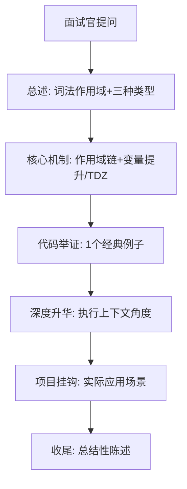

# JavaScript作用域面试通关指南.md

## 目录
1. [面试官的5种"攻击模式"](#攻击模式)
2. [回答评分标准（面试官视角）](#评分标准)
3. [自我检验清单（面试前自测）](#自测清单)
4. [终极面试话术模板（SOP流程）](#话术模板)
5. [核心知识点速查表](#速查表)

---

## <a name="攻击模式"></a>一、面试官的5种"攻击模式"

### **模式1：基础概念扫雷**
**常见问题**
- "说说你对JS作用域的理解"
- "什么是作用域链？"

**标准答案框架**
> JavaScript采用**词法作用域**（静态作用域），作用域由**声明位置**决定，而非调用位置。主要分为三种：
> 1. **全局作用域**：函数和代码块外声明，全局可访问
> 2. **函数作用域**：函数内部声明，函数内外有屏障（var/function声明）
> 3. **块级作用域**：ES6的let/const，在`{}`代码块内有效
>
> **核心机制**：当访问变量时，引擎从当前作用域向上层作用域逐级查找，直到全局，找不到则报错。

**加分项**：主动提到"词法作用域"、"变量查找机制"、"静态分析"。

---

### **模式2：代码输出题**

**经典题目1：变量提升**
```javascript
console.log(a); // undefined
var a = 1;
console.log(b); // ReferenceError
let b = 2;

// 追问：如果把var改成let会怎样？为什么？
```

**回答要点**
- `var a`会提升声明，不提升赋值 → 输出`undefined`
- `let b`存在**暂时性死区(TDZ)**，声明前使用会报错
- **底层机制**：var的变量声明在编译阶段放入变量对象，let/const在词法环境，有TDZ

---

**经典题目2：作用域链**
```javascript
var a = 10;
function foo() {
  console.log(a); // undefined（不是10！）
  var a = 20;
}
foo();

// 追问：为什么不是10？作用域查找过程是怎样的？
```

**回答要点**
- **关键**：函数作用域内var声明会提升到函数顶部
- 等价于：`var a; console.log(a); a = 20;`
- **必须画图**：foo函数自己的变量对象 → 全局变量对象

---

### **模式3：闭包陷阱题**

**经典题目**
```javascript
for (var i = 0; i < 3; i++) {
  setTimeout(() => console.log(i), 0);
}
// 输出：3,3,3
// 追问：如何改造输出0,1,2？为什么let可以解决？
```

**回答要点**
- **原因**：var没有块级作用域，共享同一个i
- **改造方案1**：IIFE创建函数作用域 `(function(i){...})(i)`
- **改造方案2**：`for(let i...)` ES6块级作用域，每次循环都是新变量
- **核心原理**：闭包捕获的是**变量的引用**，let为每次循环创建独立的词法环境

---

### **模式4：场景应用题**

**常见问题**
- "你在项目中怎么用块级作用域解决实际问题？"
- "模块化开发中如何避免全局污染？"

**回答模板**
> 我常用两种方式：
> 1. **IIFE模式**：`(function(){...})()` 创建独立函数作用域，避免全局变量冲突
> 2. **ES6模块+let/const**：利用模块天然作用域隔离，配合let/const防止变量泄露
>
> **实战案例**：之前做埋点SDK时，用闭包封装私有变量，只暴露必要API，防止外部篡改数据。

---

### **模式5：原理深挖题**

**常见问题**
- "从执行上下文角度解释作用域？"
- "作用域和this有什么区别？"

**回答要点**
```javascript
// 核心区别
作用域：静态的，由代码结构决定，关注"变量可见性"
this：动态的，由调用方式决定，关注"执行主体"

// 执行上下文创建
1. 词法分析阶段：确定作用域链（静态）
2. 执行阶段：确定this指向（动态）

// 底层实现：变量对象(VO)/活动对象(AO)
```

---

## <a name="评分标准"></a>二、回答评分标准

| 级别     | 表现特征                                       | 面试官心理    |
| -------- | ---------------------------------------------- | ------------- |
| **及格** | 能说出三种作用域类型，代码题答对但解释模糊     | "嗯...背过题" |
| **良好** | 能解释变量提升、TDZ，代码题逻辑清晰            | "基础还行"    |
| **优秀** | 主动提到词法作用域、作用域链机制，能画示意图   | "理解透彻"    |
| **惊艳** | 结合执行上下文、闭包、性能优化，有项目实战案例 | "可以发offer" |

---

## <a name="自测清单"></a>三、自我检验清单

**面试前闭卷自测，全部达标方可上场：**

1. **概念题**：不看书说出三种作用域类型和区别
2. **代码题**：2分钟内准确预测输出并解释原因：
```javascript
// 题1
var a = 1;
function f1(){ console.log(a); var a = 2; }
f1();

// 题2
let b = 1;
{ let b = 2; { console.log(b); } }

// 题3
for(var i=0; i<2; i++){
  setTimeout(()=>console.log(i), 0);
}
```
3. **画图题**：能画出任意嵌套函数的作用域链图示
4. **原理题**：能解释"词法作用域"和"作用域链"的关系
5. **应用题**：能说出至少3个项目中利用作用域解决的问题

---

## <a name="话术模板"></a>四、终极面试话术模板

### **SOP流程图**


### **标准话术（全程1分30秒）**

**步骤1：总述（10秒）**
"JS采用**词法作用域**，由声明位置决定，分**全局、函数、块级**三种。"

**步骤2：核心机制（30秒）**
"核心是**作用域链**，变量查找遵循就近原则。var有**变量提升**，let/const有**暂时性死区**。"

**步骤3：代码举证（20秒）**
"比如函数内var声明会提升到函数顶部，所以会出现暂时性undefined..."

**步骤4：深度升华（15秒）**
"这实际上与执行上下文的**变量对象**有关，是JS引擎的静态分析阶段决定的。"

**步骤5：项目挂钩（10秒）**
"我在XX项目中用闭包+块级作用域封装了私有变量..."

**步骤6：收尾（5秒）**
"所以作用域是JS变量管理的核心机制。"

**⚠️ 面试禁忌**
- 语速过快
- 术语堆砌不解释
- 只背概念不结合代码

**✨ 加分技巧**
- 用手势辅助说明作用域层级
- 主动画简图展示作用域链
- 提到"性能优化"（作用域链查找效率）

---

## <a name="速查表"></a>五、核心知识点速查表

| 概念           | 关键词         | 核心要点               |
| -------------- | -------------- | ---------------------- |
| **作用域类型** | 全局/函数/块级 | 由声明位置决定         |
| **作用域链**   | 就近查找       | 当前→外层→全局         |
| **变量提升**   | var/function   | 声明提升，赋值不提升   |
| **暂时性死区** | let/const      | 声明前使用报错         |
| **闭包**       | 函数+词法环境  | 捕获的是引用，不是值   |
| **词法作用域** | 静态作用域     | 写代码时确定，非运行时 |

---

**最后忠告**：能用自己的话解释、能快速画图、能联系实战项目，这三点做到，这道题就是送分题。祝你面试顺利！


# JavaScript作用域面试模拟训练场

我将模拟**3类真实面试场景**，展示不同回答水平，并拆解面试官的心理活动。你可以对照自己的情况，找到最适合的应对策略。

---

## 场景一：校招/初级前端面试（难度：★★☆）

### **面试官提问方式**
"同学，你了解JS的作用域吗？能说说你的理解吗？"（温和，给足引导空间）

---

### **回答水平1：不及格（45分）**
```javascript
"呃...作用域就是变量的有效范围吧...有全局变量和局部变量，用var声明的是全局的，let是局部的...在函数里声明的变量外面用不了...嗯...就这些。"
```

**面试官心理活动**：  
→ "概念模糊，没有体系，分不清var和let的区别，估计只是刷题见过但没理解。大概率背过答案但紧张忘了。只能给45分，低于50分直接挂。"

**致命问题**：
- ❌ 概念混淆（let不是"局部"，是块级）
- ❌ 没有提到作用域链
- ❌ 没有代码举例
- ❌ 语无伦次，缺乏逻辑

---

### **回答水平2：及格（65分）**
```javascript
"JS作用域分三种：全局作用域、函数作用域和块级作用域。全局作用域的变量在哪都能访问，函数作用域的变量只能在函数内部访问，块级作用域是ES6的let和const在{}里有效。还有个作用域链，就是找变量的时候会从内到外一层层找。"

// 面试官追问："能举个例子吗？"
console.log(a); // undefined，因为var声明提升了
var a = 1;
```

**面试官心理活动**：  
→ "知识点都提到了，但像背书。例子太简单，没有展示深层理解。不过对校招来说够了，能干活就行。给65分，可以过。"

**优点**：
- ✅ 覆盖了三种作用域类型
- ✅ 提到了作用域链概念

**待改进**：
- ⚠️ 解释停留在表面
- ⚠️ 没有说明底层机制
- ⚠️ 缺少主动性和深度

---

### **回答水平3：优秀（85分）**
```javascript
"JS采用的是词法作用域，简单说就是变量的可见范围由它在代码里的**声明位置**决定，而不是调用位置。

主要分为三种：
1. **全局作用域**：在函数和代码块外声明，整个应用都能访问
2. **函数作用域**：函数内部声明的变量，外部无法访问，函数执行完就销毁
3. **块级作用域**：ES6引入的let/const，在{}代码块内有效，比如for循环里用let就能避免变量污染

最核心的是**作用域链机制**。比如：

var a = 10;
function foo() {
  console.log(a); // 这里会输出undefined而不是10
  var a = 20;     // 因为函数内部也会发生变量提升
}

// 实际执行是这样的：
function foo() {
  var a;          // 声明提升到函数顶部
  console.log(a); // 所以是undefined
  a = 20;         // 赋值在原位置
}

// 面试陷阱题：for循环里用var和let的区别
for(var i = 0; i < 3; i++) { // 输出3,3,3
  setTimeout(() => console.log(i), 0);
}
for(let j = 0; j < 3; j++) { // 输出0,1,2
  setTimeout(() => console.log(j), 0);
}
// 因为let在每次循环都会创建一个新的块级作用域
```

**面试官心理活动**：  
→ "这个人有备而来！不仅回答完整，还主动举了经典陷阱题。说明他理解底层机制，知道实际开发中的坑。给85分，值得培养。"

**加分项**：
- ✅ 主动提到"词法作用域"这个关键词
- ✅ 举了变量提升和循环闭包两个经典例子
- ✅ 解释有逻辑，层层递进
- ✅ 展示了问题排查能力

---

## 场景二：社招/中级前端面试（难度：★★★★）

### **面试官提问方式**
"看你简历写了3年经验，说说JS作用域，重点讲讲作用域链和闭包的关系。"（直接，要求深度）

---

### **回答水平1：不及格（50分）**
```javascript
"作用域链就是变量查找的时候从内往外找，一直找到全局。闭包就是函数里返回函数，能访问外部变量。它们的关系...呃...闭包利用了作用域链吧？"
```

**面试官心理活动**：  
→ "3年了还说得这么浅？没有自己的理解，也没结合项目。是不是只会CRUD？闭包和作用域链的关系说不清楚，基本功不扎实。给50分，压线水平。"

**致命问题**：
- ❌ 没有结合执行上下文解释
- ❌ 闭包解释停留在"函数套函数"
- ❤️ 没有实际项目案例

---

### **回答水平2：良好（75分）**
```javascript
"作用域链是在函数定义的时候就确定了，它是静态的。当访问一个变量时，JS引擎会先在当前作用域查找，找不到就沿着作用域链去外层找。

闭包是函数和它词法环境的组合。比如：

function createCounter() {
  let count = 0;
  return function() {
    return ++count; // 这里能访问外部函数的count，就形成了闭包
  };
}

// 实际项目中，我用闭包做过：
// 1. 封装私有变量，避免全局污染
// 2. 事件委托中缓存DOM元素
// 3. 防抖节流函数

作用域链和闭包的关系是：闭包之所以能访问外部变量，就是靠作用域链机制。即使外部函数执行完了，作用域链的关系还在，所以内部函数还能找到那个变量。"
```

**面试官心理活动**：  
→ "有项目经验，知道实际应用场景。但原理层面不够深入，没提到执行上下文、VO/AO这些。不过能干活，给75分，可以考虑。"

**优点**：
- ✅ 提到了闭包的实际应用
- ✅ 基本说清了两者关系
- ✅ 有代码示例

**待改进**：
- ⚠️ 没讲底层实现机制
- ⚠️ 没涉及性能考量

---

### **回答水平3：优秀（90分）**
```javascript
"这个问题涉及到JS的核心机制，我从**执行上下文**角度来解释：

**作用域链的本质**：在函数定义时，JS引擎会把**父级的变量对象**添加到该函数的`[[Scope]]`内部属性中。当函数执行时，会创建自己的执行上下文，生成变量对象(VO)，然后沿着`[[Scope]]`形成作用域链。

// 伪代码表示：
foo.[[Scope]] = [globalContext.VO];
fooContext = { Scope: foo.[[Scope]] + fooContext.VO };

**闭包的高级理解**：闭包不仅仅是函数套函数，而是**函数与其词法环境的绑定**。当内部函数被外部持有，它的作用域链不会被销毁，所以能持续访问外部变量。

**实际项目中的深度应用**：
1. **模块化封装**：我在上家公司用闭包实现了一个事件总线，避免全局污染
```javascript
const EventBus = (function() {
  const events = {}; // 私有变量，外部无法访问
  return {
    on(event, cb) { /*...*/ },
    emit(event, data) { /*...*/ }
  };
})();
```

2. **性能优化**：用闭包缓存计算结果（记忆化）
```javascript
function memoize(fn) {
  const cache = new Map();
  return function(...args) {
    const key = JSON.stringify(args);
    if(cache.has(key)) return cache.get(key);
    const result = fn.apply(this, args);
    cache.set(key, result);
    return result;
  };
}
```

3. **作用域链的性能考量**：避免过深的作用域嵌套，因为变量查找要一级级往上找，太深会影响性能。特别是高频调用的函数，尽量把变量声明在靠近使用的位置。

**闭包和作用域链的关系总结**：闭包是现象，作用域链是机制。闭包能实现的根本原因是JS的词法作用域规则，而作用域链是这个规则的底层实现。"
```

**面试官心理活动**：  
→ "这个人有深度！能讲到执行上下文、VO、[[Scope]]这些底层概念，说明他研究过规范。还有性能优化的思考，不是只实现功能。给90分，应该是个潜力股。"

**加分项**：
- ✅ 从执行上下文角度深入剖析
- ✅ 给出了3个不同层次的项目案例
- ✅ 提到了性能优化考量
- ✅ 用伪代码展示底层机制

---

## 场景三：高级前端/架构师面试（难度：★★★★★）

### **面试官提问方式**
"说说你对JS作用域的理解。如果让你设计一个JS引擎，你会怎么实现作用域和闭包机制？另外，V8在这方面有哪些优化？"（刨根问底，考察架构思维）

---

### **回答水平1：不及格（55分）**
```javascript
"作用域就是变量的访问范围，闭包是函数内部返回函数。JS引擎怎么实现...这个底层我不太了解，V8应该做了些优化吧，比如垃圾回收什么的。"
```

**面试官心理活动**：  
→ "高级岗了还这个水平？对底层实现完全不了解，架构设计能力薄弱。给55分是看在经验份上，大概率挂。"

**致命问题**：
- ❌ 完全没涉及底层实现
- ❌ 对V8优化一无所知
- ❌ 缺乏架构设计思维

---

### **回答水平2：良好（78分）**
```javascript
"从引擎角度看，作用域主要靠**词法环境(LexicalEnvironment)**和**变量环境(VariableEnvironment)**实现。每个执行上下文都有这两个组件，它们是Environment Record的链表结构。

闭包的实现：当函数被返回时，它的作用域链会被保留，V8会把闭包引用的变量移到**堆**上，而不是栈上，这样函数执行完垃圾回收也不会清理这些变量。

V8的优化：
1. **内联缓存**：对作用域链查找做缓存
2. **隐藏类**：对对象属性访问优化，间接优化作用域查找
3. **逃逸分析**：分析闭包变量是否逃逸，决定放堆还是栈

设计引擎的话，我会：
1. 用链表实现词法环境
2. 闭包标记被引用的变量，延长生命周期
3. 做作用域链查找的性能优化"
```

**面试官心理活动**：  
→ "对V8有一定了解，知道LexicalEnvironment和堆栈区别。但设计思路比较笼统，缺乏细节。不过能达到这个水平不错了，给78分。"

**优点**：
- ✅ 提到了词法环境等专业术语
- ✅ 了解V8基础优化
- ✅ 有一定的架构思维

**待改进**：
- ⚠️ 没有结合具体场景
- ⚠️ 设计思路不够完整
- ⚠️ 缺乏对问题的批判性思考

---

### **回答水平3：惊艳（95分）**
```javascript
"这个问题很好，我从**规范实现**和**工程实践**两个层面说：

**一、规范层面（ECMAScript标准）**
ES规范定义了**词法环境(LexicalEnvironment)**模型，它是一个由**Environment Record**组成的链。每个Record有：
- **declarative records**：存储let/const/函数声明
- **object records**：存储全局对象属性

实现闭包的关键是**[[Environment]]内部属性**，每个函数都有它，指向父级词法环境。当函数被返回后，只要这个引用存在，整个作用域链就会被保留。

// 伪代码实现：
class LexicalEnvironment {
  constructor(outer) {
    this.record = new Map(); // 存储变量
    this.outer = outer;      // 指向父环境
  }
  
  get(name) {
    if(this.record.has(name)) return this.record.get(name);
    if(this.outer) return this.outer.get(name);
    throw new ReferenceError();
  }
}

**二、V8的深度优化（我见过源码）**
1. **ClosureFeedbackCell**：V8为闭包变量创建反馈单元，追踪其类型和值，加速访问
2. **ScopeInfo压缩**：把作用域信息压缩成位域，减少内存占用
3. **本地变量提升**：如果闭包只引用了函数内的部分变量，V8会**只把用到的变量移到堆**，其他还在栈上
4. **逃逸分析+标量替换**：分析变量是否真正"逃逸"，可能直接用值替换引用

**三、架构设计思路**
如果我来设计JS引擎的作用域系统，我会考虑：

1. **分层设计**：
   - **静态层**：解析阶段生成Scope Chain Descriptor（描述文件）
   - **动态层**：运行时按需创建词法环境
   - **优化层**：JIT编译时内联作用域查找

2. **性能优先策略**：
   - **词法环境缓存池**：高频使用的环境对象复用，避免重复创建
   - **并行作用域查找**：对深层嵌套使用SIMD指令加速（理论可能）
   - **闭包变量预绑定**：在函数返回时，直接把变量地址绑定到函数对象，避免运行时查找

3. **内存安全**：
   - **弱引用闭包**：某些场景下允许闭包变量被GC，避免内存泄漏
   - **作用域剖析工具**：提供runtime API，让开发者能看到作用域链

**四、实际踩过的坑**
我在上家公司遇到过一个内存泄漏问题：一个闭包引用了大对象，但只用到其中一个小字段。V8的优化不够智能，整个对象都没法回收。我们的解决方案是**解构赋值+弱引用**：

```javascript
// 优化前
function heavyClosure() {
  const hugeData = { /*...*/ };
  return function() {
    return hugeData.smallField; // 整个hugeData都无法回收
  };
}

// 优化后
function optimizedClosure() {
  const hugeData = { /*...*/ };
  const { smallField } = hugeData; // 只捕获需要的字段
  return function() {
    return smallField; // hugeData可以正常GC
  };
}
```

**总结**：作用域不仅是语法规则，更是JS引擎性能优化和内存管理的核心战场。理解底层机制才能写出高性能代码。"
```

**面试官心理活动**：  
→ "这个人是专家级别！能从规范讲到源码，有架构设计能力，还结合实际踩坑经验。不仅知道是什么，还知道为什么和怎么做优化。给95分，必须抢人！"

**加分项**：
- ✅ 给出了伪代码实现
- ✅ 提到V8源码级优化（FeedbackCell等）
- ✅ 有架构设计图思维
- ✅ 结合实际内存泄漏案例和解决方案
- ✅ 最后有批判性思考和总结

---

## 你的自我定位与提升路径

| 你现在的水平 | 典型表现 | 面试目标 | 提升建议 |
|------------|---------|---------|---------|
| **初级水平** | 能说出概念但缺代码举例 | 达到**场景一优秀**水平 | 1. 背熟3个经典代码题<br>2. 练习画图解释作用域链<br>3. 准备1个项目案例 |
| **中级水平** | 能举例但讲不清底层原理 | 达到**场景二优秀**水平 | 1. 学习执行上下文机制<br>2. 研究V8优化基础<br>3. 准备性能优化案例 |
| **高级水平** | 懂原理但缺架构思维 | 达到**场景三惊艳**水平 | 1. 看V8源码解析文章<br>2. 思考"如果我来设计"的问题<br>3. 总结真实踩坑经历 |

---

## 面试现场应急 checklist

✅ **开场必说**："JS采用词法作用域..."（直接定位到专业高度）  
✅ **举例必画**：随手画作用域链图示（展示深度理解）  
✅ **追问必杀**：提前准备3个不同难度的代码例子（应对连环问）  
✅ **结尾必升**："这在我项目中..."（联系实际）  
✅ **禁忌必避**："我记得好像..."（不确定的词别说）

---

**现在，请告诉我：**
1. 你觉得自己目前处于哪个场景的水平？
2. 你最想提升哪个部分？（代码举例/底层原理/项目案例）
3. 要不要我针对你的薄弱环节做专项训练？

我可以为你定制模拟面试！
```


下面这段内容把「原型链」的面试考点、答題套路以及在校生需要注意的细节都梳理了一遍。你可以直接拿来做复习笔记，也可以面试前快速过一遍。

---

## 1. 一句话总结（面试开场用）

**原型链**是 JavaScript 实现继承的核心机制：每个对象都有一个私有属性 `[[Prototype]]`（在浏览器中常暴露为 `__proto__`），指向它的“原型对象”；原型对象本身也有自己的原型，直到顶层 `Object.prototype`（其原型为 `null`）。当读取对象属性时，若对象自身不存在，引擎会沿这条链向上查找，直到找到或到达顶端为止。

> **面试小技巧**：开场用上面这段话，既简洁又涵盖了所有关键点。语速放慢，重点词（`[[Prototype]]`、`__proto__`、`Object.prototype`）重读，给面试官一个清晰的“地图”。

---

## 2. 核心概念再深化（若面试官追问细节）

| 术语                   | 说明                                                         | 常见误区                                                     |
| ---------------------- | ------------------------------------------------------------ | ------------------------------------------------------------ |
| **`__proto__`**        | 对象实例的私有指针，指向构造函数的 `prototype`。非标准，已废弃，仅在浏览器环境下可用。 | ❌ 不要把 `__proto__` 和 `prototype` 搞混。<br>✅ 现代代码用 `Object.getPrototypeOf()` / `Object.setPrototypeOf()`。 |
| **`prototype`**        | 构造函数上的一个**公共**对象，所有实例共享。放方法、静态属性最合适。 | ❌ 把引用类型（数组、对象）直接放在 `prototype` 上会导致所有实例共享同一块内存。 |
| **`constructor`**      | `prototype` 上的一个属性，指回构造函数本身，用于辨别“我是谁”。 | ❌ 手动改写 `prototype` 时忘记补 `constructor`，会导致继承链断裂。 |
| **`[[Prototype]]`**    | 规范里的内部插槽（slot），引擎实际使用的指针，不可直接访问。 | ✅ 理解它即可，不必纠结如何“直接”操作它。                     |
| **`Object.prototype`** | 所有普通对象的终点，提供 `toString`、`hasOwnProperty` 等基础方法。 | ✅ 记住它的 `__proto__` 是 `null`，标志链的结束。             |

**图示（面试时可在白板随手画）**

```text
┌──────────────┐
│  实例 obj    │
│  __proto__ ──┼────►┌──────────────┐
└──────────────┘     │  原型对象    │
                     │  __proto__ ──┼────► ... → Object.prototype → null
                     └──────────────┘
```

---

## 3. 必考代码演示（手写 3 种继承方式）

### 3.1 ES5 构造函数 + `new`

```javascript
function Animal(name) {
  this.name = name;          // 实例属性
}
Animal.prototype.say = function() {
  console.log('I am ' + this.name);
};

function Dog(name) {
  Animal.call(this, name);   // 1. 借用父构造函数（属性继承）
}
Dog.prototype = Object.create(Animal.prototype); // 2. 建立原型链（方法继承）
Dog.prototype.constructor = Dog;                 // 3. 修复 constructor

const dog = new Dog('旺财');
dog.say();                   // I am 旺财
console.log(dog instanceof Dog);    // true
console.log(dog instanceof Animal); // true
```

**面试要点**：
- `Animal.call(this, name)` → 实现**属性**的“私有复制”。
- `Object.create(Animal.prototype)` → 创建新对象，原型指向父原型，避免直接引用。
- **必须**修复 `constructor`，否则 `dog.constructor` 会指向 `Animal`。

### 3.2 `Object.create()` 极简版

```javascript
const animal = {
  say() { console.log('Animal'); }
};
const dog = Object.create(animal);
dog.speak = function() { console.log('Woof'); };

dog.say();   // 在 dog 上找不到 → 去 animal 找 → 输出 "Animal"
```

**面试要点**：说明 `Object.create(null)` 的用途——创建“干净”的字典对象（没有 `toString` 等干扰）。

### 3.3 ES6 `class`（语法糖）

```javascript
class Animal {
  constructor(name) { this.name = name; }
  say() { console.log(`I am ${this.name}`); }
}
class Dog extends Animal {
  constructor(name) { super(name); }    // 调用父类构造
  bark() { console.log('Woof'); }
}

const dog = new Dog('旺财');
dog.say();   // 继承来的方法
```

**面试要点**：`class` 本质还是原型链，`extends` 会被转译成 `Object.create()` + `constructor` 调用。能说出这一点，说明你懂“语法糖”背后的真相。

---

## 4. 面试官常问 6 大类问题 & 校招生应答策略

### 4.1 基础概念类

> **Q1**：请解释一下 `prototype` 和 `__proto__` 的区别。

**校招回答模板**：
- `prototype` 是**函数**特有的属性，用来存放共享方法；`__proto__` 是**对象**的私有指针，指向自己的原型。
- 实例的 `__proto__` 等于构造函数的 `prototype`（`instance.__proto__ === Constructor.prototype`）。
- 现代代码用 `Object.getPrototypeOf()` 替代 `__proto__`。

### 4.2 手写代码类

> **Q2**：手写一个函数 `createObject(proto)`，模拟 `Object.create()`。

```javascript
function createObject(proto) {
  // 校招答题时注意边界：proto 必须是对象或 null
  if (typeof proto !== 'object' && typeof proto !== 'function') {
    throw new TypeError('Object prototype may only be an Object or null');
  }
  function F() {}
  F.prototype = proto;
  return new F();
}
```

**要点**：体现对原型链的创建过程的理解——借助一个空的构造函数作为“跳板”。

### 4.3 陷阱 & 常见问题类

> **Q3**：把**引用类型**放在 `prototype` 会有什么问题？

```javascript
function Foo() {}
Foo.prototype.arr = [1, 2, 3];

const f1 = new Foo();
const f2 = new Foo();
f1.arr.push(4);
console.log(f2.arr); // [1, 2, 3, 4]  // → 意料之外的共享
```

**校招应答**：
- 引用类型会被**所有实例共享**，可能导致数据污染。
- 解决：把引用属性放在构造函数里 `this.arr = [1,2,3];`，保证每个实例独立。

> **Q4**：修改原型链后，`instanceof` 行为会变化吗？

```javascript
function A() {}
function B() {}
const a = new A();
console.log(a instanceof A); // true

// 动态改原型
Object.setPrototypeOf(a, B.prototype);
console.log(a instanceof A); // false
console.log(a instanceof B); // true
```

**要点**：`instanceof` 检查的是**原型链上的构造函数是否存在**，链变了，结果就变。

### 4.4 性能 & 实践类

> **Q5**：原型链过长会带来什么性能问题？

**校招应答**：
- **查找耗时**：深层属性（如 `obj.a.b.c.d`）需要多次遍历链，虽然单次很快，但高频调用会有累积开销。
- **优化建议**：把高频访问的深层属性缓存为局部变量（`const d = obj.a.b.c.d;`），减少重复遍历。

> **Q6**：为什么不推荐直接修改 `Object.prototype`？

**校招应答**：
- **污染全局**：所有对象都会继承这些改动，可能导致第三方库或旧代码意外依赖或冲突。
- **安全风险**：恶意代码可通过原型链注入攻击（原型链污染）。
- **实践**：只修改自定义构造函数的原型，绝不碰内置原型。

### 4.5 深层细节类

> **Q7**：如何让一个对象**没有原型链**？

```javascript
const dict = Object.create(null);
console.log(dict.toString); // undefined
```

**校招应答**：`Object.create(null)` 创建的对象其 `[[Prototype]]` 是 `null`，完全“干净”，适合做键值对字典，避免 `hasOwnProperty` 被覆盖的隐患。

> **Q8**：`class` 里的 `super` 做了什么？

**校招应答**：
- 在子类构造函数里，`super()` 等价于**父类构造函数的调用**，同时将当前实例的 `this` 指向父类构造函数，让父类给实例初始化属性。
- 原型链上：`super.method()` 实际上是调用父原型上的方法，`this` 仍指向子类实例（保证“动态 this”）。

---

## 5. 校招面试的“加分项”与“避雷针”

| 加分项 ✅                                    | 避雷针 ❌                                 |
| ------------------------------------------- | ---------------------------------------- |
| 能用画图/白板把链画出来                     | 只说“__proto__ 指向 prototype”却没有实例 |
| 主动提到“性能”与“共享引用”陷阱              | 只说“JS 用原型继承”，说不出具体实现      |
| 提到 `Object.create(null)` 的用处           | 混淆 `prototype` 与 `__proto__` 的概念   |
| 知道 `class` 是语法糖，能讲转译后的大致逻辑 | 只背 MDN 定义，没有手写代码              |
| 强调“不修改内置原型”的工程实践              | 对 `instanceof` 的动态性一无所知         |
| 能解释 `constructor` 的作用并会修复         | 忘记修复 `constructor` 导致链断裂        |

---

## 6. 实战面试模拟（完整话术示例）

**面试官**：请用简单的话解释原型链，并写一段代码说明。

**你（校招版）**：

> “好的，原型链就是**对象查找属性的‘向上询问’机制**。每个对象都有一个私有的 `__proto__` 指针，指向它的原型对象；原型对象也有自己的原型，一直往上，直到 `Object.prototype`（它的原型是 `null`）。如果自身没有某个属性，引擎就会沿着这条链往上找。
>
> 举个例子（边写边说）：
> ```javascript
> // 父类
> function Animal(name) { this.name = name; }
> Animal.prototype.say = function() { console.log('I am ' + this.name); };
> 
> // 子类
> function Dog(name) { Animal.call(this, name); }
> Dog.prototype = Object.create(Animal.prototype);
> Dog.prototype.constructor = Dog;
> 
> const dog = new Dog('旺财');
> dog.say();   // 在 dog 上找不到 → 去 Dog.prototype → 找不到 → 去 Animal.prototype → 找到
> ```
>
> 这里我注意三点：
> 1. 用 `Animal.call` 继承**属性**，防止引用类型共享；
> 2. 用 `Object.create` 建立**原型链**，避免直接把父类实例赋给原型；
> 3. 修复 `constructor`，保证 `dog instanceof Dog` 正确。
>
> 另外，现代开发中我们会用 `class` 语法，但它本质还是原型链的语法糖。”

**面试官追问**：那你觉得原型链有什么性能问题吗？

**你**：

> “主要问题是**查找耗时**。如果链很长，比如 `obj.a.b.c.d`，每次访问都要逐层遍历。高频调用时会有累积开销。我的做法是**缓存深层属性**，或者用解构赋值提前拿到需要的值。
>
> 另外，**不存在的属性会遍历整条链**，这也是一个小陷阱。所以代码里尽量避免‘点操作符’的链式猜测，必要时用 `hasOwnProperty` 或 `in` 运算符先做判断。”

---

## 7. 复习清单（面试前 10 分钟速记）

- [ ] `__proto__`（实例私有指针） vs `prototype`（构造函数共享对象）
- [ ] `Object.create()` 的作用 & polyfill 思路
- [ ] `new` 的四步：创建空对象 → 绑定原型 → 执行构造 → 返回对象
- [ ] `class` 转译后 ≈ `constructor` + `prototype` + `Object.create()`
- [ ] 引用类型放 `prototype` 会导致共享 → 放在构造函数里 `this.xxx = []`
- [ ] 性能：链越深查找越慢；不存在的属性会走完全程 → 缓存 & 预判
- [ ] 安全：绝不修改 `Object.prototype` / `Array.prototype`
- [ ] `instanceof` 动态性：改原型链后结果会变
- [ ] `Object.create(null)` 的用途——干净字典
- [ ] 手写继承三步：父构造函数 call + Object.create + constructor 修复

---

**最后的心态调整**  
原型链只是 JavaScript 的“继承”实现方式，不是玄学。面试时把它当成**对象查找属性的路径**来理解，画个图、写段代码、提一下性能和安全，基本就能拿下。校招生不需要把每个边界 case 都背得滚瓜烂熟，但**上面列出的 10 个 checklist**一定要能随口说出，遇到手写代码也能一气呵成。

祝你面试顺利，拿下满意 Offer！